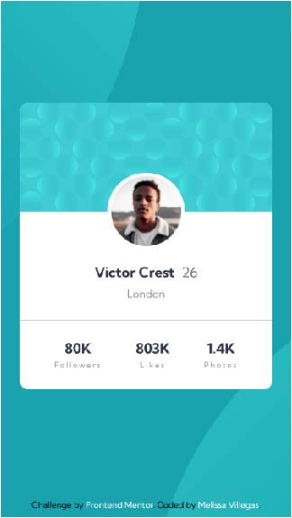

# Frontend Mentor - Profile card component solution

This is a solution to the [Profile card component challenge on Frontend Mentor](https://www.frontendmentor.io/challenges/profile-card-component-cfArpWshJ).

[Frontend Mentor](https://www.frontendmentor.io) challenges help you improve your coding skills by building realistic projects.

## Screenshot

#### Mobile Screenshot

#### Desktop Screenshot

## Links

- Live site URL: [Profile card component](https://melissavi08.github.io/profile-card-component/index.html)

## Useful resources

- [CSS background-position Property](https://developer.mozilla.org/en-US/docs/Web/CSS/background-position) - This helped me to align the patterns in the background.

## Built with

    

## Connect with me

 
